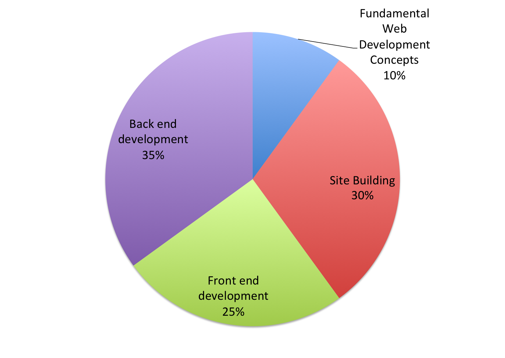

# Exam Domains

| Domain | % of Questions |
| :--- | :--- |
| 1.0 Fundamental Web Development Concepts | 10% |
| 2.0 Site Building | 30% |
| 3.0 Front end Development \(Theming\) | 25% |
| 4.0 Back end Development \(Coding\) | 35% |
| **TOTAL** | **100** |

**Note:** This exam blueprint includes topics, domains, and test objectives to help guide the test taker. It should not be construed as a comprehensive listing of all of the content of this examination.

Learn more about the Acquia Certification Program at [https://www.acquia.com/customer-success/learning-services/acquia-certification-program](https://www.acquia.com/customer-success/learning-services/acquia-certification-program)

